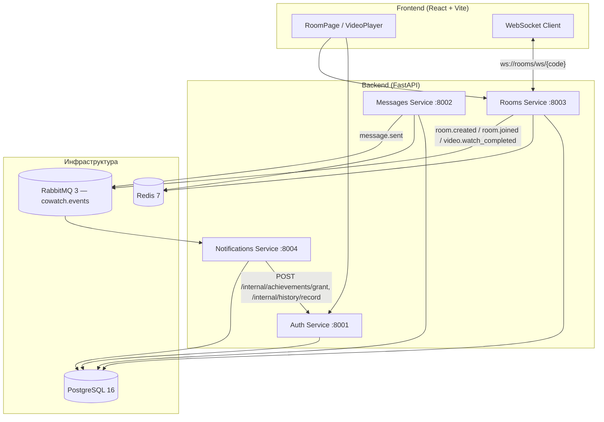

<div align="center">

# CoWatch

Сервис для совместного просмотра видео с друзьями: общий плеер, синхронизация play/pause/seek, чат и реакции в реальном времени.

**[cowatch.fun](https://cowatch.fun)** · [Быстрый старт](#быстрый-старт) · [Возможности](#возможности) · [Архитектура](#архитектура) · [Планы](#планы)

<br />

[](https://github.com/mivlabs/cowatch/actions/workflows/ci.yml)
[](https://fastapi.tiangolo.com/)
[](https://react.dev/)
[](https://www.typescriptlang.org/)
[](https://redis.io/)
[](https://www.postgresql.org/)

</div>

---

## Демо

Проект уже развёрнут и доступен по адресу **[https://cowatch.fun](https://cowatch.fun)**.

> **Для пользователей из России:** сайт может не открываться или работать нестабильно без VPN. Это ограничение связано с доступностью хостинга и внешних сервисов, а не с блокировкой со стороны проекта.

Можно создать комнату, отправить другу 6-буквенный код и смотреть YouTube, Rutube или прямую ссылку на видео вместе.

---

## Возможности

| | |
|---|---|
| **Синхронный плеер** | Воспроизведение, пауза и перемотка синхронизируются у всех участников через WebSocket |
| **Разные источники** | YouTube, Rutube, прямые ссылки на видеофайлы |
| **Чат** | Сообщения в комнате во время просмотра |
| **Реакции** | Эмодзи поверх видео |
| **Роли host / guest** | Управление плеером и смена видео только у хоста |
| **Гостевой вход** | Можно зайти с ником без регистрации |
| **Регистрация** | Email, пароль, JWT |
| **Комнаты** | Приватные комнаты по коду, до 50 участников |
| **Real-time** | Redis Pub/Sub для рассылки событий |
| **Ачивки и история просмотра** | Кросс-сервисные события в RabbitMQ (создание/вход в комнату, сообщения, законченный просмотр) → notifications считает пороги и выдаёт ачивки через auth |

---

## Как пользоваться

1. Зайди на [cowatch.fun](https://cowatch.fun) или подними проект локально.
2. Создай комнату или введи код приглашения.
3. Хост вставляет ссылку на видео. Остальные участники видят тот же ролик в том же месте таймлайна.

У гостей плеер синхронизирован с хостом, чат открывается сразу после входа в комнату.

---

## Архитектура

Бэкенд разбит на микросервисы. События в комнатах (чат, видео, реакции) идут через WebSocket и Redis Pub/Sub.
Кросс-сервисная система ачивок работает отдельно, через события в RabbitMQ: rooms и messages публикуют
доменные события (создание комнаты, вход в комнату, отправленное сообщение, законченный просмотр),
notifications их слушает, проверяет условия ачивок и выдаёт их через внутренний HTTP-эндпоинт auth.



### Стек

**Frontend:** React 19, TypeScript, Vite, Tailwind CSS, Framer Motion, React Query, React Router, React Player

**Backend:** Python 3.11, FastAPI, SQLAlchemy 2.0 (async), PostgreSQL, Redis, JWT

**События и ачивки:** RabbitMQ (topic exchange `cowatch.events`, aio-pika) — rooms/messages публикуют
события, notifications их слушает и идемпотентно выдаёт ачивки через внутренний API auth
(защищён общим секретом `INTERNAL_API_SECRET`, не JWT)

**Инфра:** Docker Compose

---

## Быстрый старт

Нужны Docker Desktop, Node.js 20+ и Git.

### 1. Клонировать репозиторий

```bash
git clone https://github.com/mivlabs/cowatch.git
cd cowatch
```

### 2. Запустить сервисы

```bash
docker-compose up -d postgres redis rabbitmq
docker-compose up -d auth rooms messages notifications
```

Проверка:

```bash
curl http://localhost:8001/health
curl http://localhost:8003/health
curl http://localhost:8004/health
```

### 3. Запустить фронтенд

```bash
cd frontend
npm install
npm run dev
```

Фронтенд будет на [http://localhost:5173](http://localhost:5173).

### Переменные окружения

Файл `frontend/.env` (если нужен):

```env
VITE_AUTH_URL=http://localhost:8001
VITE_API_URL=http://localhost:8003
VITE_WS_URL=ws://localhost:8003
```

---

## Структура проекта

```
cowatch/
├── frontend/           # React SPA
├── services/
│   ├── auth/          # Регистрация, логин, гостевой JWT, ачивки, watch-history
│   ├── rooms/         # Комнаты, WebSocket, синхронизация видео, события в RabbitMQ
│   ├── messages/      # Сервис сообщений, события в RabbitMQ
│   ├── notifications/ # Слушает cowatch.events, выдаёт ачивки через internal API auth
│   └── gateway/       # WIP: единая точка входа, ещё не реализован
├── tests/              # pytest для auth/rooms/messages/notifications
├── infra/postgres/     # init-скрипт БД для docker-compose
├── docker-compose.yml
└── README.md
```

> `gateway` пока присутствует в `docker-compose.yml` как заготовка (папка, Dockerfile,
> пустой `app/main.py`) — реальный трафик через него не идёт, фронтенд ходит в
> `auth`/`rooms`/`messages` напрямую по портам 8001–8003. `notifications` (порт 8004)
> с ачивками уже боевой — просто у него нет собственного публичного REST API, кроме
> `/health`: он только слушает RabbitMQ и зовёт auth.

---

## API

| Метод | Endpoint | Описание |
|-------|----------|----------|
| `POST` | `/auth/register` | Регистрация |
| `POST` | `/auth/login` | Вход |
| `POST` | `/auth/guest?username=…` | Гостевой вход |
| `POST` | `/rooms/` | Создать комнату |
| `GET` | `/rooms/{code}` | Получить комнату |
| `POST` | `/rooms/{code}/join` | Присоединиться к комнате |
| `PATCH` | `/rooms/{code}/video` | Сменить видео (только хост) |
| `WS` | `/rooms/ws/{code}?token=…` | Чат, видео-события, реакции |
| `GET` | `/auth/profile/{user_id}` | Ачивки, история просмотра, total_movies/total_hours |
| `POST` | `/internal/achievements/grant` | Только для notifications, секрет `X-Internal-Secret` |
| `POST` | `/internal/history/record` | Только для notifications, секрет `X-Internal-Secret` |

Типы WebSocket-событий: `chat_message`, `video_play`, `video_pause`, `video_seek`, `video_end`, `video_changed`, `video_reaction`, `connected`, `system`.
`video_play`/`video_pause`/`video_end` также используются rooms для трекинга личного времени просмотра
(per user, per room) — по ним считается `video.watch_completed`.

### Ачивки

| Ачивка | Условие |
|---|---|
| Первый шаг | Регистрация |
| Хозяин вечеринки | Создание первой комнаты |
| Душа компании | Присоединение к 5 разным комнатам |
| Полный кинозал | Комната набрала максимум участников |
| Болтун | 100 отправленных сообщений (суммарно) |
| Первый киносеанс | Один законченный просмотр (`video_end`) |
| Марафонец | 10+ часов просмотра суммарно |

Гости (`/auth/guest`) не получают ачивки и историю — у них нет строки в таблице `users`
(`UserAchievement`/`WatchHistory` ссылаются на `users.id` через FK), так что
`/internal/*` эндпоинты тихо игнорируют неизвестный `user_id`. Это осознанное решение,
а не забытый баг — см. `services/auth/app/services/achievement_service.py`.

---

## Планы

- Личный кабинет на фронтенде для ачивок и истории просмотра (бэкенд уже отдаёт `/auth/profile/{user_id}`)
- Публичные комнаты
- Поиск фильмов и сериалов прямо в интерфейсе
- Мобильная версия сайта или отдельное приложение
- API Gateway как единая точка входа
- Уведомления при приглашении в комнату
- Более точная синхронизация с учётом сетевой задержки

---

## Тестирование

pytest гоняется отдельно на каждый сервис (`auth`, `rooms`, `messages`, `notifications` —
все называют свой корневой пакет `app`, поэтому им нужен разный `PYTHONPATH`;
`scripts/test.sh` уже это учитывает). Нужны поднятые Postgres, Redis и RabbitMQ:

```bash
docker-compose up -d postgres redis rabbitmq

pip install -r requirements-dev.txt
pip install -r services/auth/requirements.txt      # для конкретного сервиса
./scripts/test.sh auth                              # или без аргумента — все сразу
```

`rooms` тестируется против настоящего Postgres, а не sqlite: `Room.id` — колонка
типа `UUID`, специфичная для диалекта postgresql, на sqlite такая таблица просто
не создастся.

`notifications` тестируется против настоящего RabbitMQ, а не мока aio-pika: главный
риск в системе ачивок — разъехавшиеся exchange/routing key/формат сообщения между
publisher (rooms/messages) и consumer, и это именно то, что мок скрыл бы, а не поймал.
Его тесты дополнительно поднимают auth как второе FastAPI-приложение в том же процессе
(см. `tests/test_notifications/conftest.py`) и подменяют только транспорт HTTP-вызова
в auth на `ASGITransport` — без реального сокета, но с настоящим запросом/ответом.

CI (`.github/workflows/ci.yml`) поднимает postgres/redis/rabbitmq как сервис-контейнеры и
гоняет тот же `scripts/test.sh` по каждому сервису в матрице, плюс `ruff check` и
сборку фронтенда.

---

## Вклад в проект

Pull request'ы и issue приветствуются. Перед PR стоит описать задачу в issue и проверить сборку: `npm run build`.

---

## Лицензия

MIT
